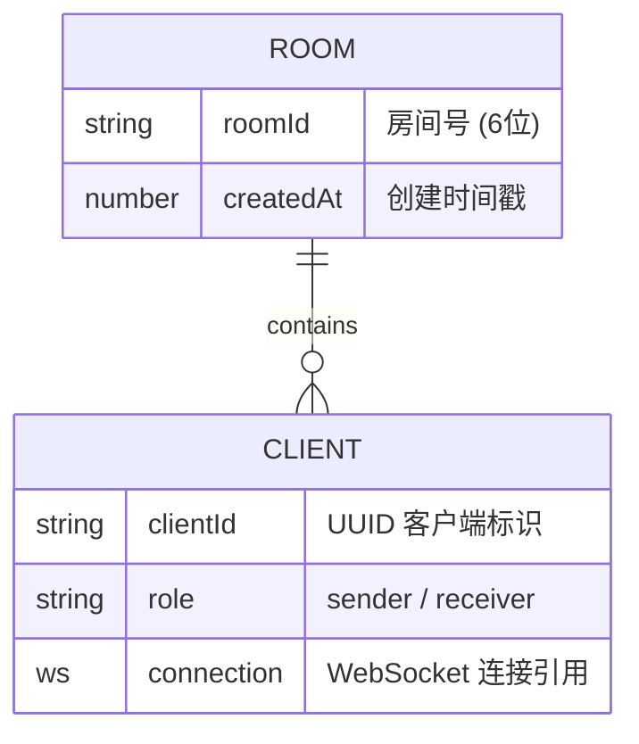

## 1. 架构设计

```mermaid
flowchart TD
    subgraph "前端 (React + Vite, :50003)"
        "A端页面" -- "getDisplayMedia + RTCPeerConnection" --> "本地媒体流"
        "B端页面" -- "RTCPeerConnection ontrack" --> "video 播放"
        "A端页面" -- "WebSocket 信令" --> "信令客户端"
        "B端页面" -- "WebSocket 信令" --> "信令客户端"
    end
    subgraph "信令服务器 (Node.js + Express + ws, :30003)"
        "Express 静态代理 / 健康检查" 
        "ws WebSocket 服务" --> "房间管理器"
        "房间管理器" --> "内存房间表"
    end
    "信令客户端" <--> "ws WebSocket 服务"
    "A端页面" <-->|"P2P 媒体流 (RTP)"| "B端页面"
```

架构分为三层：前端（React 单页应用，承载 A/B 两端的 WebRTC 逻辑）、信令服务器（Express 提供静态托管与 HTTP 端点，ws 处理 WebSocket 信令）、以及两端之间通过 WebRTC 建立的 P2P 媒体传输通道。信令服务器仅在握手阶段参与，媒体流建立后由 P2P 直连传输。

## 2. 技术说明

- 前端：React@18 + Vite（开发服务器监听 50003 端口）
- 信令服务器：Node.js + Express@4 + ws@8（监听 30003 端口）
- WebRTC：原生 `RTCPeerConnection`、`RTCSessionDescription`、`RTCIceCandidate`、`navigator.mediaDevices.getDisplayMedia()`
- 视频编码：通过 `RTCRtpSender.setParameters()` 设置 `VP8` 优先；H.264 作为备选
- STUN：使用 Google 公共 STUN 服务器（`stun:stun.l.google.com:19302`）用于 NAT 穿透候选收集
- 样式：原生 CSS（CSS 变量驱动主题），不引入额外 UI 框架

## 3. 路由定义

| 路由 | 用途 |
|------|------|
| `/` | 信令控制台（首页 / 房间入口，角色切换与房间操作） |
| `/sender` | A 端屏幕共享工作台 |
| `/receiver` | B 端播放工作台 |

## 4. API 定义（WebSocket 信令协议）

信令服务器与前端之间通过 JSON 文本消息通信。每条消息形如：

```ts
interface SignalMessage {
  type: 'create-room' | 'room-created' | 'join-room' | 'peer-joined'
      | 'offer' | 'answer' | 'candidate' | 'leave' | 'error' | 'state';
  payload?: any;
  room?: string;       // 房间号
  from?: string;       // 发送方 clientId
  to?: string;         // 接收方 clientId
}
```

关键消息：

| 消息 type | 方向 | 说明 |
|-----------|------|------|
| `create-room` | A→Server | 请求创建房间 |
| `room-created` | Server→A | 返回分配的房间号与自身 clientId |
| `join-room` | B→Server | 携带房间号请求加入 |
| `peer-joined` | Server→A | 通知 A 端有 B 端加入（携带 B 的 clientId） |
| `offer` | A→B（经 Server） | A 端发起的 SDP Offer |
| `answer` | B→A（经 Server） | B 端回复的 SDP Answer |
| `candidate` | 双向（经 Server） | 交换 ICE 候选 |
| `leave` | 双向（经 Server） | 离开房间通知 |
| `state` | Server→Client | 房间状态广播 |

## 5. 服务器架构图

```mermaid
flowchart LR
    "ws Server" --> "消息路由器 (type dispatch)"
    "消息路由器" --> "房间管理器 RoomStore"
    "消息路由器" --> "客户端注册表 ClientStore"
    "房间管理器" --> "内存房间表 Map<roomId, Set<clientId>>"
    "客户端注册表" --> "WebSocket 连接表 Map<clientId, ws>"
```

信令服务器采用单进程内存存储房间与客户端映射，职责单一：维护房间成员、转发 SDP 与 ICE 消息。不做媒体流中转。

## 6. 数据模型

### 6.1 数据模型定义



### 6.2 数据定义语言

本演示使用纯内存数据结构，无持久化数据库。核心结构为：

- `rooms: Map<roomId, { createdAt, clients: Map<clientId, ws> }>`
- `clients: Map<clientId, { roomId, role, ws }>`

房间号生成规则：6 位大写字母数字随机串，碰撞时重试。
